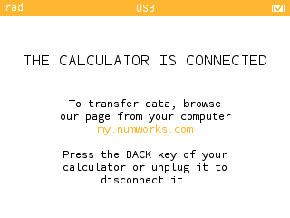
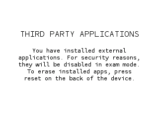

# External apps

The [NumWorks calculator](https://www.numworks.com) allows you to install and run external apps created by yourself or the community.

Resets or crashes will remove external apps from the device.
Since version 24.3.0, the external apps are only hidden in exam-mode,
and are available again once the exam-mode is removed.

Numworks provides a few example external apps:
- [sample_c](sample_c): a C application plotting squares and using external data
- [sample_cpp](sample_cpp): a space invaders game
- [sample_rust](sample_rust): not C/C++ based, following setup instructions do not apply, see [sample_rust instructions](sample_rust/README.md).
- [rpn_cpp](rpn_cpp): a RPN engine to be completed

The rest of this document contains instructions that will guide you to install
the [sample_cpp](sample_cpp) app on a Numworks calculator or on a simulator.
The commands are to be executed from [this](./) folder.

You can swap `sample_cpp` for any other C/C++ based external app (e.g.: `rpn_cpp` or `sample_c`).

## Requirements

To build an external app, you will need:
- A `C` compiler (`gcc` is expected on Windows and Linux and `clang` is expected on MacOS). You can run [Epsilon's setup script](../build/setup.sh) for that
- [npm](https://docs.npmjs.com/downloading-and-installing-node-js-and-npm) to install `nwlink` :
```shell
npm install -g nwlink
```

## Build and install the app on your calculator

To install the app on your calculator, it must be plugged in and
on the `CALCULATOR IS CONNECTED` screen:



Then, run the following commad to build and install the app:
```shell
make -C sample_cpp PLATFORM=device run
```

A `THIRD PARTY APPLICATIONS` message will appear,
and the app should be accessible at the end of the Home menu.



### Distribute your `app.nwa`

The `.nwa` file extension denotes an external app for the Numworks calculator.

Anyone can install an `app.nwa` on their calculator from [NumWorks online uploader](https://my.numworks.com/apps).

To build your own `nwa` file, run:
```shell
make -C sample_cpp PLATFORM=device build
```

You should now have a `sample_cpp.nwa` file in `sample_cpp/output/device/` that you can distribute!

## Try your app on an Epsilon simulator

When creating your app, testing on the physical device can be a bit tedious.
Running your app on a simulator allows you to test and debug more easily.

#### Prepare your simulator

By default, the platform-specific Epsilon simulators are expected in their
corresponding [epsilon_simulators](epsilon_simulators/) folder.

See instructions to build them (from [Epsilon's root](../)):
- [Web](epsilon_simulators/web/README.md): `epsilon.html`
- [Linux](epsilon_simulators/linux/README.md): `epsilon.bin`
- [MacOS](epsilon_simulators/macos/README.md): `epsilon.app/Contents/MacOS/Epsilon`
- [Windows](epsilon_simulators/windows/README.md): `epsilon.exe`

Simulator path can also be overridden with the `SIMULATOR=[PATH_TO_SIMULATOR]` compilation flag.

### Native simulator (MacOS, Linux, Windows)

```shell
make -C sample_cpp PLATFORM=simulator run
```

A native simulator should open directly on the app.

You can also debug your app using `gcd` (or `lldb` on MacOS).
```shell
make -C sample_cpp PLATFORM=simulator debug
```

### Web simulator

#### Additional Setup

Depending on you system:
- Windows:
```shell
./setup_web.ps1
```
- Others:
```shell
chmod +x setup_web.sh & ./setup_web.sh
```

#### Launch a server

On a separate shell, run
```shell
make -C sample_cpp server
```

#### Build and run your app

In the other shell, run:
- Windows
```shell
emsdk/emsdk_env.ps1
```
- Others
```shell
source emsdk/emsdk_env.sh
```

Finally, run

```shell
make -C sample_cpp PLATFORM=web run
```

Your browser should display the simulator with the app inside.

## License

These apps are distributed under the terms of the BSD License. See LICENSE for details.

## Trademarks

NumWorks is a registered trademark.
