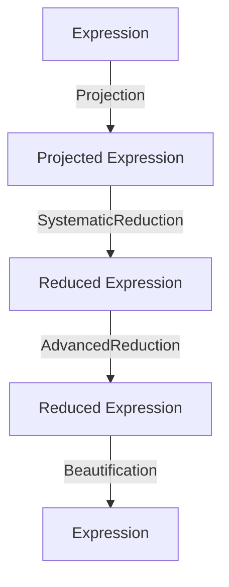
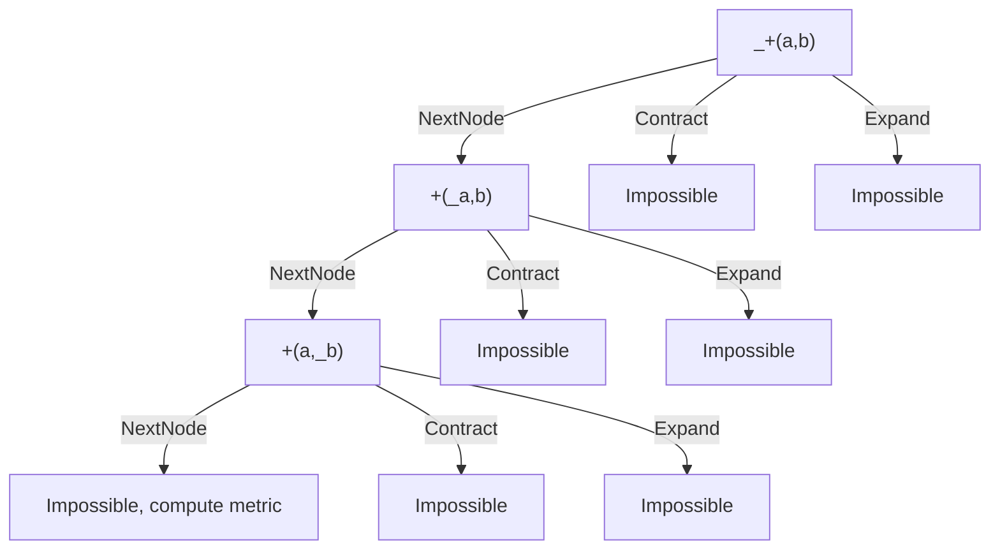
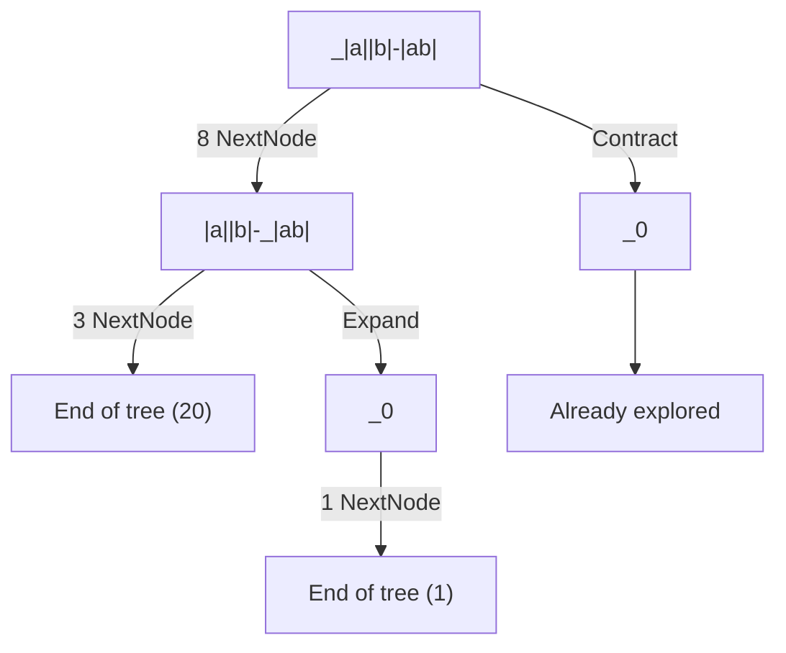

# Simplification algorithm

## Generalities

Starting from any expression, the simplification algorithm finds a better and reduced mathematically equivalent expression.

Steps can be summarized to this:



Steps:
- `Projection` removes `complexMode`, `angleUnit`, ...
- `SystematicReduction` applies obvious reductions
- `AdvancedReduction` finds the best reduced representation
- `Beautification` undoes `Projection` and applies readability improvements
- In practice, `Beautification` also prepares for `Layouter`

Expression properties:
- Projected Expressions are made of specific `Nodes`
- Projected Expressions are independent from `ComplexMode`, `AngleUnit`, ...
- Reduced Expressions are Projected Expressions

These operations never need to be applied twice.


## Detailed steps

- [Seed the random nodes](#random-nodes-seeding)
- [Replace local symbols with variables](#local-symbols)
- [Replace symbols and functions stored in context](#global-symbols)
- [Ensure the expression has a valid dimension](#dimension-check)
- [Project the expression, approximate depending on the strategy](#projection)
- [Apply systematic reduction](#systematic-reduction)
- [Bubble up lists, applying systematic reduction](#list-bubble-up)
- [Apply advanced reduction](#advanced-Reduction)
- [Simplify Dependencies](#simplify-dependencies)
- [Extract and improve units ](#extract-units)
- [Approximate again, depending on the strategy](#final-approximation)
- [Beautify expression](#beautification)

## Random nodes seeding

Since the next steps may duplicate parts of the expression, we need to seed each random node because a duplicated random node should evaluate to the same random number.

For example, with this projection, both random should always approximate to the same value.
```math
sinh(random())=\frac{e^{random()}-e^{-random()}}{2}
```


<details>
<summary>Exception with some parametrics</summary>

For parametrics (in particular `Sum`, `Product` and `ListSequence`, others just do not handle random) containing a randomized expression, we want to approximate each instance of the expression to a different random, for instance:

$sum(random(),k,0,1) = random()+random() ≠ 2*random()$

We handle this problematic with the following steps:

- the expression is seeded as usual

$sum(random_1(),k,0,1)$

- we prevent any randomized node from entering or leaving the scope of the parametric

$sum(random_1(),k,0,1)$ cannot reduce to $2*random_1()$

and

$random_1()+sequence(random_2(),k,2)$ cannot reduce to $sequence(random_1()+random_2(),k,2)$

- when we approximate a parametric, we approximate each instance of the expression with new values for each seed (by giving a clean `randomContext` each time)

$$sum(tan(random_1()),k,0,1)$$

approximates via

$$\frac{sin(random_1())}{cos(random_1())} + \frac{sin(random_1^{new}())}{cos(random_1^{new}())}$$

<details>
<summary>Reasons for handling parametrics this way</summary>

We want to respect the following properties:

- $random()$ cannot be approximated during reduction
- $random()-random()$ should not be reduced to 0
- $tan(random())$ should be well distributed
- $sequence(random(),k,10)$ should not be reduced to $random()*sequence(1,k,10)$

A possible solution would be to seed random nodes via a child containing an expression evaluating to an integer, so that we could seed nodes inside parametrics with a formula dependant on k. This would mean forbidding randomized nodes in integrals and diff, and having a solution for a too high number of seeds (for instance always returning a different result).

This solution was deemed too heavy for now, which is why parametrics are only handled at approximation.

</details>

</details>

## Global functions

After random seeding and before projecting local symbols, global functions need to be replaced recursively if `SymbolicComputation` allows it.

If a function has been replaced, random nodes are seeded again.

For example if $f(x)=x+x+random()$, the expression $f(random())*f(0)$ has been:
- Seeded to $f(random_1())*f(0)$
- Replaced to $(random_1()+random_1()+random())*(0+0+random())$,
- Seeded again to $(random_1()+random_1()+random_2())*(0+0+random_3())$

## Local symbols

Local symbols are projected to an id, based on how nested they are in the local contexts, using de Bruijn indexes. Global symbols are preserved.

Below this expression are written the projected ids of the local user symbols.

```
a + diff(c + x + sum(k + a + x, k, 1, x), x, b) + diff(a, a, a)
a        c   0       0   a   1  k     0   x  b         0  a  a
```

The second child of the parametric (e.g. "k" in the sum above) is kept unaltered and will be used to restore the name during the beautification.

When nested inside a parametered expression, all ids are incremented. In the parametered expression, `0` is the local parameter.

This variable id has to be accounted for when comparing trees, or manipulating them in and out of parametric expressions, using `Variables::LeaveScope` and `Variables::EnterScope` (move the variable out and in the parametric expression and increment/decrement the id).

## Global symbols

User symbols stored in the given context are replaced with their definition (see `SymbolicComputation` enum for replacement rules).

If allowed by `SymbolicComputation`, symbols with no definition are left unchanged.

### Global variable's properties

During our simplification algorithms, the global user symbols and functions are considered to be scalar.

This allows for simplifications such as $`x*y*x=x^{2}*y`$, which wouldn't be possible if $x$ was a matrix.

Matrices could still be stored in variables, but it would be replaced on projection.

User functions and sequences have an unknown complex sign, so $re(f(0))$ cannot be simplified further.

However, user symbols are considered real, $re(x)$ simplifies to $x$ under any `ComplexFormat`.

<details>
<summary>Why are user symbols are considered real ?</summary>

We considered two alternatives that weren't satisfying enough as of now. In the future, we should come back on this to allow more versatile usages.

#### 1 - Unknown complex sign for user symbols as well

They would behave like user functions.

Impactful simplifications in applications using UserSymbols as reals are then impossible.

For example, in Epsilon's Grapher, we analyze conics in `x` and `y` which will always be evaluated at real values.

#### 2 - User symbols could store their own sign

Just like variables, we could store the UserSymbol's sign in its node.

We can no longer create UserSymbol Trees without needing a special context.

For example, when computing an expression's polynomial degree depending on `x`, its sign would be required to be able to create a UserSymbol tree to compare subtrees with.

However, we try not to rely on any context when manipulating projected expressions.

</details>

## Dimension check

Dimension covers scalars, points, booleans, units, matrix size, and list size (handled in different functions in a similar way).

This is done as early as possible so that all following steps can assume the dimension is correct, removing the need for many checks.

Some issues such as NonReal, division by zero or other undefinitions can still arise later.

## Approximation strategy

The simplification algorithm handles two simplification strategies:
 - `Default`: Default strategy.
```math
ln(2)*x+\frac{1}{3}+random()*\pi
```
 - `ApproximateToFloat`: Everything that can be approximated to a float is approximated (everything but variables, random, expressions having children that cannot be approximated).
```math
0.693*x+0.333+random()*3.14
```

`ApproximateToFloat` strategy is less demanding in term of tree size, but the quality of the simplification will downgrade compared to the `Default` one.

Strategy is a context parameter given to the simplification. We start simplification with the given strategy, and we can downgrade the strategy during the simplification process if `TreeStack` is full for example.

Most of the time, we use the `Default` strategy and let the simplification handle eventual strategy change.

## Projection

It is expected to:
- Approximate everything that can be if strategy is `ApproximateToFloat`.
- Reduce the number of equivalent representations of an expression (`Div(A,B)` -> `Mult(A, Pow(B, -1))`). It replaces nodes not handled by reduction with other nodes handled by reduction.
- Un-contextualize the expression (remove complex format and angle units considerations from reduction algorithm)
- Do nothing if applied a second time

### Effects

For example, in degrees, $cos(x)-y+frac(z)+arccot(x)$ would be projected to

$$trig(x*π/180,0)+(-1)*y+z+(-1)*floor(z)+π/2-atan(x)$$

<details>
<summary>Examples of projections</summary>

All projection operations can be found [here](/poincare/src/expression/projection.cpp), in method `ShallowSystemProject`.

| Match | Replace |
|---|---|
| decimal{n}(A) | 10^(-n)×A |
| cos(A) | trig(A×RadToAngleUnit, 0) |
| sin(A) | trig(A×RadToAngleUnit, 1) |
| acos(A) | atrig(A, 0)×RadToAngleUnit |
| asin(A) | atrig(A, 1)×RadToAngleUnit |
| atan(A) | atanRad(A)×RadToAngleUnit |
| sqrt(A) | A^0.5 |
| e^A | exp(A) |
| A^B (with real complex format) | powerReal(A, B) |
| ceil(A) | -floor(-A) |
| frac(A) | A - floor(A) |
| e | exp(1) |
| conj(A) | re(A)-im(A)×i |
| - A | (-1)×A |
| A - B | A + (-1)×B |
| A / B | A×B^-1 |
| log(A, e) | ln(A) |
| log(A) | ln(A)×ln(10)^(-1) |
| log(A, B) | ln(A)×ln(B)^(-1) |
| lnUser(A) (with real complex format) | dep(ln(A), {NoNull(A), powReal(A,1/2))}) |
| lnUser(A) (otherwise) | dep(ln(A), {NoNull(A)}) |
| sec(A) | 1/cos(A) |
| csc(A) | 1/sin(A) |
| cot(A) | cos(A)/sin(A) |
| arcsec(A) | acos(1/A) |
| arccsc(A) | asin(1/A) |
| arccot(A) | π/2-atan(A) |
| cosh(A) | cos(i×A) |
| sinh(A) | -i×sin(i×A) |
| tanh(A) | -i×tan(i×A) |
| arsinh(A) | -i×asin(i×A) |
| artanh(A) | -i×atan(i×A) |

</details>

### Projection in advanced reduction

Some projections are too difficult to undo at beautification, and may be useless if it unlocks no further simplifications.

To tackle this, we try to apply the projection later, during advanced reduction.

For example, `atan(x)` could be projected to `asin(x/√(1 + x^2))`, so that systematic reduction doesn't have to handle `atan` nodes. But `asin(x/√(1 + x^2))` can be too difficult to convert back to `atan(x)`, which is a much better form to beautify. So this "projection" is done during advanced reduction, in the method `Projection::Expand`.

Advanced reduction can undo it if it doesn't improve the overall expression, and systematic reduction will just ignore the un-projected node.

This practice tends to slow down advanced reduction so we limit it to the very minimum.

<details>
<summary>Examples of projections in advanced reduction</summary>

See `Projection::Expand` in [projection code](/poincare/src/expression/projection.cpp).

| Match | Replace |
|---|---|
| atan(A) | asin(A / sqrt(A^2 + 1)) |
| arcosh(A) | ln(A + sqrt(A^2 - 1)) |

</details>

## Systematic reduction

It is expected to:
- Be efficient and simple
- Apply obvious and definitive changes
- Do nothing if applied a second time

### Effects

Systematic reduction can reduce rational operations, convert non-integer powers to their exponential/logarithm form, factorize variables in simple additions or even compute exact derivatives.

Dependencies are already bubbled-up at each shallow systematic reduce.

<details>
<summary>Examples of systematic reductions</summary>

See `SystematicReduction::Switch` [here](/poincare/src/expression/systematic_reduction.cpp).

| Match | Replace |
|---|---|
| A+(B+C) | A+B+C |
| A×(B×C) | A×B×C |
| A+Dep(B, C) | Dep(A+B, C) |
| 1^x | 1 |
| 0^B (with re(B) <= 0) | undef |
| 0^B (with re(B) > 0) | 0 |
| 0^B | Dep(0, 0^B) |
| A^B (with B not an integer) | exp(B×ln(A)) |
| A^0 (with A != 0) | 1 |
| A^0 | Dep(1, A^0) |
| A^1 | A |
| i^n | 1, i, -1 or -i |
| (w^p)^n | w^(p×n) |
| (w1×...×wk)^n | w1^n×...×wk^n |
| exp(a)^b | exp(a×b) |
| +(A) | A |
| +() | 0 |
| B + A | A + B |
| 0 + A + B | A + B |
| 2 + 4.1 | 6.1 |
| 2×a + 4.1×a | 6.1×a |
| ×(A) | A |
| ×() | 1 |
| B×A | A×B |
| 2×4.1 | 8.2 |
| 0×A | 0 |
| 1×A×B | A×B |
| t^m×t^n | t^(m+n) |
| powerReal(A, B) (with A complex or positive, or B integer) | A^B |
| powerReal(A, B) (with A negative, B negative rational p/q, q even) | unreal |
| powerReal(A, B) (with A negative, B rational p/q, q odd) | ±abs(A)^B |
| abs(abs(x)) | abs(x) |
| abs(x) (when x is a number) | ±x |
| trigDiff({1,1,0,0}, {1,0,1,0}) | {0, 1, 3, 0} |
| trig(-x,y) | ±trig(x,y) |
| trig(πn/120, B) (with some values of n) | exact value |
| trig(atrig(A,B), B) | A |
| trig(atrig(A,B), C) | sqrt(1-A^2) |
| trig(±inf, A) | undef |
| atrig(-x,1) | - atrig(x,1) |
| atrig(-x,0) | π/2 - atrig(x,0) |
| atrig(trig(π×y, i), j) (with y real for all following) | π/2 - atrig(trig(π×y, i), i) |
| atrig(trig(π×y, 0), 0) (with ⌊y + π/2⌋ even) | π×(y - ⌊y + π/2⌋) |
| atrig(trig(π×y, 0), 0) (with ⌊y + π/2⌋ odd) | π×(⌊y + π/2⌋ - y) |
| atrig(trig(π×y, 1), 1) (with ⌊y⌋ even) | π×(y - ⌊y⌋) |
| atrig(trig(π×y, 1), 1) (with ⌊y⌋ odd) | π×(y - ⌊y⌋ + 1) |
| atrig(A,B) (with A one of the exact values) | exact value |
| atrig(trig(i×x, 0), 0) (with x real) | abs(i×x) |
| atrig(trig(i×x, 1), 1) (with x real) | i×x |
| atan(tan(i×x)) (with x real) | i×x |
| atan(tan(x)) (with x real) | x reduced to ]-π/2, π/2[ |
| arcsin(-x) | -arcsin(x) |
| arccos(-x) | π - arccos(x) |
| atan({-1, 0, 1}) | {-π/4, 0, π/4} |
| atan(-x) | -atan(x) |
| acosh(cos(x)) (with x pure imaginary) | abs(x) |
| cos(arcosh(x)×i) | x |
| diff(A) (with all n children of A having a known partial derivative) | diff(child(A, 0))×partialDiff(A, 0) + ... + diff(child(A, n))×partialDiff(A, n) |
| partialDiff(A×B×C×D, 2) | A×B×D |
| partialDiff(A + B + C + D, 2) | 1 |
| partialDiff(exp(x), 0) | exp(x) |
| partialDiff(ln(x), 0) | 1/x |
| partialDiff(Trig(x, n), 0) | Trig(x, n - 1) |
| partialDiff(Trig(x, n), 1) | 0 |
| partialDiff(x^n, 0) | n×x^(n - 1) |
| partialDiff(x^n, 1) | 0 |
| ln(exp(x)) (with x real) | x |
| ln(-1) | iπ |
| ln(i) | π/2×i |
| ln(1) | 0 |
| ln(inf) | inf |
| ln(0) | -inf |
| exp(ln(x)) | x |
| exp(0) | 1 |
| exp(inf) | inf |
| exp(-inf) | 0 |
| exp(B×ln(A)) (with B an integer) | A^B |
| arg(0) | undef |
| arg(x) (with re(x) = 0)| π/2 if im(x) > 0, -π/2 if im(x) < 0 |
| arg(x) (with re(x) > 0) | arctan(im(x)/re(x)) |
| arg(x) (with re(x) < 0 and im(x) >= 0) | arctan(im(x)/re(x)) + π |
| arg(x) (with re(x) < 0 and im(x) < 0) | arctan(im(x)/re(x)) - π |
| arg(e^(iA)) (with A real) | A reduced to ]-π,π] |
| im(x) (with re(x) = 0) | -ix |
| im(x) (with im(x) = 0) | 0 |
| re(x) (with re(x) = 0) | 0 |
| re(x) (with im(x) = 0) | x |
| sum(k, k, m, n) | n(n + 1)/2 - (m - 1)m/2 |
| sum(k^2, k, m, n) | n(n + 1)(2n + 1)/6 - (m - 1)(m)(2m - 1)/6 |
| sum(f, k, m, n) (with f independent of k or random nodes) | f×(1 + n - m) |
| sum(f, k, m, n) (with m > n) | 0 |
| prod(f, k, m, n) (with f independent of k or random nodes) | f^(1 + n - m) |
| prod(f, k, m, n) (with m > n) | 1 |
| gcd(B, gcd(C, A)) | gcd(A, B, C) |
| lcm(B, lcm(C, A)) | lcm(A, B, C) |
| gcd(A) | A |
| lcm(A) | A |
| gcd(A, B) (with A, B integers) | exact value if A, B integers, undef otherwise |
| lcm(A, B) (with A, B integers) | exact value if A, B integers, undef otherwise |
| rem(A, 0) | undef |
| quo(A, 0) | undef |
| rem(A, B) (with A, B integers) | exact value |
| quo(A, B) (with A, B integers) | exact value |
| A! (with A positive integer) | exact value |
| A! (else) | Prod(k, 1, A, k) |
| binomial(n,k) (with valid n, k) | (n - 0)/(k - 0) × ... × (n - j)/(k - j) × ... × (n - k - 1)/(k - k + 1) |
| permute(n, k) (with valid n, k) | n!/(n-k)! |
| sign(A) | 0 / 1 / -1 if A sign is known |
| ⌊A⌋ (with A rational) | exact value |
| round(A, B) (with valid A, B) | floor(A×10^B + 1/2)×10^-B |
| diff(dep(x, {ln(x), z}), x, y) | dep(diff(x, x, y), {diff(ln(x), x, y), z}) |

The following methods directly reduce to their result:
- listSort(L)
- median(L)
- dim(A)
- L(n)
- mean(L)
- stddev(L)
- variance(L)
- sampleStdDev(L)
- minimum(L)
- maximum(L)
- sum(L)
- prod(L)
- identity(n)
- cross(u, v)
- dot(u, v)
- det(M)
- reff(M)
- ref(M)
- inverse(M)
- norm(M)
- power(M)
- trace(M)
- transpose(M)

</details>

### Shallow bubble up

At each shallow step in systematic reduction, some expressions needs to be bubbled-up.

#### Undefined trees

Most trees are set to undefined if one of their children is undefined.

There are some exceptions like points or lists (`(undef, x)`,`{1, undef, 3}`). See `Undefined::CanHaveUndefinedChild` for more examples.

If multiple `undef` can be bubbled up, we select the most "important" one. For instance, `DivisionByZero` has precedence over `NonReal`.

#### Floats

If a tree has float children, it could be approximated as well.

Indeed, we don't preserve $ln(0.333)$ and systematically reduce it with $-1.099$.

#### Dependencies

Dependencies are always bubbled-up to the top.

Most of the time, we just merge and move the dependencies up:

`dep(x, {x, z}) + dep(y, {y, z})` becomes `dep(x + y, {x, y, z})`.

With most parametrics, we account for the local context:

`sum(dep(k, {f(k), z}), k, 1, n)` becomes `dep(sum(k, k, 1, n), {sum(f(k), k, 1, n), z})`

With dependency, we can replace the local variable:

`diff(dep(x, {ln(x), z}), x, y)` becomes `dep(diff(x, x, y), {ln(y), z})`

## List bubble up

At this step, there are still nested lists in the expression, but we know the expected list length.
The list expression is turned into an actual list node by `List::BubbleUp`.
It build the elements one at a time, using `GetElement` to retrieve them.

For instance: `GetElement({2, 3, 4}, 1) -> 3` and `GetElement(ListSequence(2*k, k, 50), 36) -> 2*36 -> 72`

## Advanced Reduction

It is expected to:
- Reduce any reducible expression if given enough resources
- Do its best with limited resources
- Be deterministic
- Ignore dependencies

### Effects

Using `Expand` and `Contract` formulas, advanced reduction tries to transform the expression, and calls systematic reduction at each step.

Some expansion operations are used specifically to expand algebraic operations (+, ×, ^) and are thus grouped together to be called on their own when necessary (for instance, to expand a polynomial function before computing its coefficients, see [k_expandAlgebraicOperations](/poincare/src/expression/advanced_reduction.h)).

<details>
<summary>Examples of advanced reductions</summary>

See the list of operations in `k_contractOperations` and `k_expandOperations` [here](/poincare/src/expression/advanced_reduction.h).

| Match | Replace |
|---|---|
| A?×\|B\|×\|C\|×D? | A×\|BC\|×D |
| \|A×B?\| | \|A\|×\|B\| |
| \|A\| | exp(ln(re(A)^2+im(A)^2)/2) |
| exp(A?×i) | cos(A) + sin(A)×i |
| exp(A + B?) | exp(A)×exp(B) |
| A?×exp(B)×exp(C)×D? | A×exp(B + C)×D |
| A? + cos(B) + C? ± sin(B)×i + D? | A + C + D + exp(±B×i) |
| A?×(B + C?)×D? | A×B×D + A×C×D |
| A? + B?×C×D? + E? + F?×C×G? + H? | A + C×(B×D + F×G) + E + H |
| (A? + B)^2 | (A^2 + 2×A×B + B^2) |
| (A + B?)^n = sum(binomial(n, k) * A^k * B^(n-k), k, 0, n)
| 1/A with A not pure and never infinite | conj(A)/(A*conj(A)) |
| A×ln(B) (with A integer) | ln(B^A) + (A×arg(B) - arg(B^A))×i |
| A? + ln(B) + C? + ln(D) + E? | A + C + ln(BD) + E + (arg(B) + arg(D) - arg(BD))×i |
| ln(12/7) | 2×ln(2) + ln(3) - ln(7) |
| ln(A×B?) | ln(A) + ln(B) - (arg(A) + arg(B) - arg(AB))×i |
| ln(A^B) | B×ln(A) - (B×arg(A) - arg(A^B))×i |
| ln(exp(A)) | re(A) + i×arg(exp(i×im(A))) |
| (B×arg(A) - arg(A^B))×i | k×2π×i (when k can be found) |
| (arg(A) + arg(B) - arg(A×B))×i | k×2π×i (when k can be found) |
| A? + cos(B)^2 + C? + sin(D)^2 + E? | 1 + A + C + E |
| A?×Trig(B, C)×D?×Trig(E, F)×G? | 0.5×A×D×(Trig(B - E, TrigDiff(C, F)) + Trig(B + E, C + F))×G |
| Trig(A? + B, C) | Trig(A, 0)×Trig(B, C) + Trig(A, 1)×Trig(B, C-1) |
| sum(f + g, k, a, b) | sum(f, k, a, b) + sum(g, k, a, b) |
| sum(x_k, k, 0, n) | x_0 + ... + x_n |
| prod(f×g, k, a, b) | prod(f, k, a, b)×prod(g, k, a, b) |
| prod(x_k, k, 0, n) | x_0×...×x_n |
| Prod(u(k), k, a, b) / Prod(u(k), k, a, c) (with c < b) | Prod(u(k), k, c+1, b) |
| binomial(n, k) | n! / (k!(n - k)!) |
| permute(n, k) | n! / (n - k)! |
| tan(A) | sin(A) / cos(A) |
| atan(A) | asin(A / Sqrt(1 + A^2)) |
| tan(atan(A)) | A |
| arcosh(A) | ln(A + sqrt(A^2 - 1)) |
| im(x + y) | im(x) + im(z) |
| re(x + y) | re(x) + re(z) |
| im(x×y) | im(x)re(y) + re(x)im(y) |
| re(x×y) | re(x)re(y) - im(x)im(y) |
| A? + B?×im(C)×D? + E? | A - BCD×i + B×re(C)×D×i + E |
| A? + B?×re(C)×D? + E? | A + BCD - B×im(C)×D×i + E |

</details>

#### Examples

See examples of advanced reduction in [annex](advanced-reduction-examples).

### Metric

To decide which form of an expression is best for us, we implement our own metric on expressions. We call a metric any function assigning a score to a given expression. In our case, we want the metric to give a sense of the "size" or "complexity" of our expression, so that, in advanced reduction, we aim to minimize this metric. The metric is thus called at each leaf of the advanced reduction search, to compare the leaf expression to the best expression found until then (i.e. expression with the lowest metric).

Ideally, a metric should yield a different result for different expressions. In case of an equality, we currently fallback on hash comparison in advanced-reduction.

A simple metric consists in counting the size of an expression, but it would not take into account that some nodes appear or disappear at beautification (and calling beautification at each step of the advanced reduction would be too costly). Some nodes are also less desirable than others and having our own metric gives us more power to decide which expression we want to display.

#### Examples

Let's call $m: E \longrightarrow \mathbb{R_{\geq 0}}$ our metric on $E$ the set of all expressions.

The basic metric gives a default cost to all nodes and goes recursively through the expression to add the cost of the main node and all of its descendants.

For some functions, we aim to reduce the size of the expression inside them, so we increase the cost of all of their children with a multiplicative coefficient. Also, the metric of some expressions is reduced to other metrics.

Examples (non exhaustive list):
| Expression | Metric reduction |  |
|---|---|---|
| m(-1 * A) | m(-1)+m(A) | ignore the cost of multiplication, since it will be beautified into -A |
| m(LongInteger) | m(Integer)*size() | we prefer shorter numbers, same for LongRationals |
| m(Abs(A)) | m(Abs)+m(A)*coeff | increased coefficient for children of abs (same for arg, im, root, ln, etc) |
| m(Trig(A,0)) | m(Trig)+m(A) | ignore the second child indicating the type of trigonometric function (same for ATrig) |
| m(Exp(1/2*Ln(A))) | m(Exp)+m(A) | beautifies to √A so we do not count the cost of 1/2 and Ln |
| m(Exp(1/2*Ln(A))) with A negative | m(Exp)+m(A)*coeff | same as √A with an increased coefficient for A negative |

A null metric indicates the expression is ideal and cannot be reduced further.

It is used to escape advanced reduction when the best possible representation has been found.

For example, the expression $2+pi$ cannot be reduced further.

See `CannotBeReducedFurther` in [metric.h](/poincare/src/expression/metric.h).

## Reduce dependencies

In this step, we remove useless dependencies from a dependency tree:
- Break up simple dependencies into smaller bits (`dep(..,{x*y})` and `dep(..,{x+y})` become `dep(..,{x ,y})`).
- Remove dependencies that are identical or contained in others dependencies, or in the main expression.
- Remove dependencies that can be approximated to a value.
- Replace the entire dependency with undef or nonreal if one of the dependencies is approximated to undef or nonreal.

## Extract units

At this step, units have been preserved throughout simplification.

We extract the units, and find the best representative (`s` or `min` for example) and the best prefix (`mm` or `cm` for example) and replace it in the expression.

If the expression has non-angle units, change the approximation strategy to `ApproximateToFloat`.

## Final approximation

With an approximation strategy, we approximate again here in case previous steps unlocked new possible approximations.

## Beautification

This step basically undoes earlier steps in the following order:

### Restore complex format

This steps needs to be applied first, before any other beautification step that could prevent reduction or complex formatting.

Depending on the complex format, we try to beautify the expression $A$ into one of this form :
- Cartesian Form : $re(A)+i \times im(A)$
- Polar Form : $|A| \times e^{i \times arg(A)}$
- Default : $A$

If cartesian complex format is to be applied, we create the real and imaginary parts of the expression and reduce them.

If one of the part could not be reduced further and is still of the form `re(...)` or `im(...)`, we escape and continue beautification normally in default case.

Otherwise, each part is individually beautified (using following steps) and they are merged into an addition at the end.

The polar complex format is analogous to the cartesian format by replacing real/imaginary part with module/argument.

### Restore angle unit

All angle-dependant functions have been projected to radians during projection.

They are restored to the initial angle unit.

An advanced reduction may be called again after that because the created angle factors may be advanced reduced again. We can do this because, at this step, the expression is still mostly projected.

### Beautify

This step undoes the projection by re-introducing nodes not handled by reduction (For example, `Division`, `Log`, `Power` with non-integer indexes...).

`Addition`, `Multiplication`, `GCD` and `LCM` are also sorted differently.

Expressions such as PercentAddition are also beautified:
$A+B\\%$ becomes $A*(1+\frac{B}{100})$.

Rationals are turned into fractions, $0.25$ becoming $\frac{1}{4}$ for example.

### Restore Variable names

User variables, as well as nested local variables are restored to their original names.

## Annex

#### Advanced Reduction Examples

`_` represents the node that is being examined.

- Unsuccessful advanced reduction on simple tree $a+b$.



- Successful advanced reduction on $|a||b|-|ab|=0$.

For clarity, Impossible paths are removed and nextNode are concatenated.



- Successful advanced reduction on
$$-a^2-b^2+(a+b)^2+a(c+d)^2=a(2b+(c+d)^2)$$
NextNode explorations are hidden for clarity.

```mermaid
graph TD;
  Root["-a^2-b^2+(a+b)^2+a(c+d)^2"]-->X1["36 VS 36"]
  Root-->|Expand|A["-a^2-b^2+(a+b)^2+a(c^2+2cd+d^2)"]
    A-->X2["45 VS 36"]
    A-->|Expand|AA["-a^2-b^2+(a+b)^2+ac^2+a(2cd+d^2)"]
      AA-->X3["49 VS 36"]
      AA-->|Expand|AAA["-a^2-b^2+(a+b)^2+ac^2+2acd+ad^2"]
        AAA-->X4["49 VS 36"]
        AAA-->|Expand|AAAA["2ab+ac^2+2acd+ad^2"]
          AAAA-->X5["Full path, 34 VS 36"]
        AAA-->|Contract|AAAB["(a+b)^2-(a^2+b^2)+ac^2+2acd+ad^2"]
          AAAB-->X6["Full path, 48 VS 34"]
          AAAB-->|Contract|AAABA["(a+b)^2-(a^2+b^2)+ad^2+a(c^2+2cd)"]
            AAABA-->X7["Full path, 48 VS 34"]
      AA-->|Expand|AAB["2ab+ac^2+a(2cd+d^2)"]
        AAB-->X8["34 VS 34"]
        AAB-->|Contract|AABA["a(2b+c^2)+a(2cd+d^2)"]
          AABA-->X9["Full path, 34 VS 34"]
          AABA-->|Contract|AABAA["a(2b+c^2+2cd+d^2)"]
            AABAA-->X10["Full path, 26 VS 34"]
      AA-->|Contract|AAC["(a+b)^2-(a^2+b^2)+ac^2+a(2cd+d^2)"]
        AAC-->X11["48 VS 26"]
        AAC-->|Expand|AACA["a^2+2ab+b^2-(a^2+b^2)+ac^2+a(2cd+d^2)"]
          AACA-->X12["Full path, 55 VS 26"]
          AACA-->|Contract|AACAA["a^2+b^2-(a^2+b^2)+a(2b+c^2)+a(2cd+d^2)"]
            AACAA-->X13["Full path, 55 VS 26"]
        AAC-->|Contract|AACB["(a+b)^2-(a^2+b^2)+a(c^2+2cd+d^2)"]
          AACB-->X14["44 VS 26"]
          AACB-->|Expand|AACBA["a^2+2ab+b^2-(a^2+b^2)+a(c^2+2cd+d^2)"]
            AACBA-->X15["Full path, 51 VS 26"]
    A-->|Expand|AB["2ab+a(c^2+2cd+d^2)"]
      AB-->X16["30 VS 26"]
      AB-->|Contract|ABA["a(2b+c^2+2cd+d^2)"]
        ABA-->X17["26 VS 26"]
        ABA-->|Contract|ABAA["a(c^2+d^2+2(b+cd))"]
          ABAA-->X18["Full path, 27 VS 26"]
          ABAA-->|Expand|ABAAA["ac^2+a(d^2+2(b+cd))"]
            ABAAA-->X19["Full path, 33 VS 26"]
    A-->|Contract|AC["(a+b)^2-(a^2+b^2)+a(c^2+2cd+d^2)"]
      AC-->X20["44 VS 26"]
      AC-->|Expand|ACA["a^2+2ab+b^2-(a^2+b^2)+a(c^2+2cd+d^2)"]
        ACA-->X21["51 VS 26"]
        ACA-->|Contract|ACAA["a^2+b^2-(a^2+b^2)+a(2b+c^2+2cd+d^2)"]
          ACAA-->X22["49 VS 26"]
          ACAA-->|Contract|ACAAA["a^2+b^2-(a^2+b^2)+a(c^2+d^2+2(b+cd))"]
            ACAAA-->X23["Full path, 50 VS 26"]
  Root-->|Expand|B["2ab+a(c+d)^2"]
    B-->X24["21 VS 26"]
    B-->|Contract|BA["a(2b+(c+d)^2)"]
      BA-->X25["19 VS 21"]
  Root-->|Contract|C["(a+b)^2-(a^2+b^2)+a(c+d)^2"]
    C-->X26["35 VS 19"]
    C-->|Expand|CA["a^2+2ab+b^2-(a^2+b^2)+a(c+d)^2"]
      CA-->X27["42 VS 19"]
      CA-->|Contract|CAA["a^2+b^2-(a^2+b^2)+a(2b+(c+d)^2)"]
        CAA-->X28["42 VS 19"]
```


